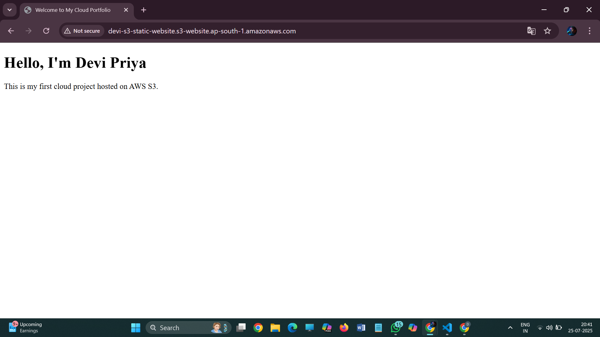

# 🌐 AWS S3 Static Website Hosting

---

## 🛠️ Technologies Used
- HTML
- AWS S3
- Static Website Hosting
- Bucket Policy

---
## 📷 Screenshot

---

## 💡 What I Learned
- Hosting static websites on AWS S3
- Making files publicly accessible
- Setting up bucket policies
- Accessing S3 URLs from the browser

---

## 🔜 Next Steps
- Hosting a website using Amazon EC2
- Exploring Route 53 for domain mapping
